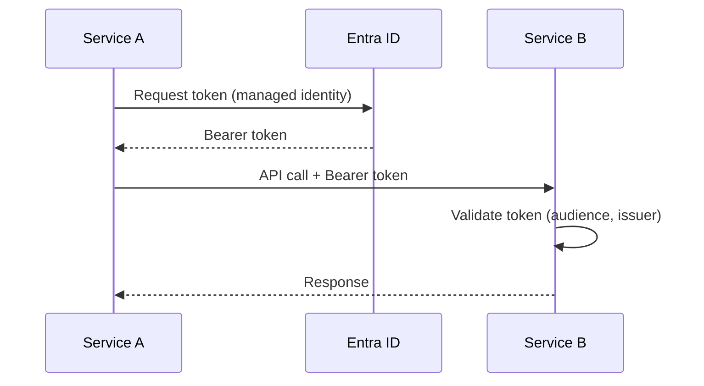

# Acidni LLC - Master Copilot Instructions

---

> **INHERITANCE MODEL**: This is the **master instruction file** for all Acidni LLC projects.
> Project-specific instructions (like Terprint) **inherit** from this file and add domain-specific content.

---

## 🏢 Company Overview

**Acidni LLC** is a software consulting and product company specializing in:
- **AI Consulting & Integration** - AI-powered application modernization
- **Azure Cloud Architecture** - Enterprise cloud solutions on Microsoft Azure
- **Packaged Software Products** - SaaS platforms and developer tools

### Our Products
- **Terprint** - Cannabis dispensary data analytics platform (Azure Marketplace)
- **ACCM (Acidni Copilot Chat Manager)** - VS Code extension for managing Copilot chat history

---

## 🚨 CRITICAL DIRECTIVES — ALL PROJECTS 🚨

> **These rules apply to EVERY Acidni project. Violations will cause production issues.**

### DIRECTIVE 1: REPOSITORY BOUNDARIES

- **EACH APP LIVES IN ITS OWN REPOSITORY** — Do NOT edit files in sibling repos
- **Cross-cutting changes go through the config project** (e.g., `terprint-config`)
- **CREATE WORK ITEMS** to track changes needed across repos
- If you need changes in another repo, document the requirement and create a work item

### DIRECTIVE 2: AZURE AUTHENTICATION

- **NEVER use API keys** for service-to-service authentication
- **NEVER hard-code secrets** in source code
- **ALWAYS use Entra ID (Azure AD)** managed identities
- **ALWAYS validate token audience** to prevent token reuse attacks
- **Store all secrets** in Azure Key Vault

### DIRECTIVE 3: DOCUMENTATION REQUIREMENTS

- Every repo **MUST have** `README.md` with setup instructions
- Every repo **MUST have** `docs/` folder with architecture documentation
- Keep docs in sync with code changes (update in same PR)
- Use Mermaid diagrams for architecture visualization

### DIRECTIVE 4: CODE QUALITY

- **All code must pass linting** before commit
- **All code must have tests** (unit tests at minimum)
- **All PRs must be reviewed** before merge
- **Use conventional commits** format: `feat:`, `fix:`, `docs:`, `chore:`

### DIRECTIVE 5: USE REFERENCE DATA - DON'T ASK

- **DO NOT ASK** about Azure resources, function apps, APIM endpoints, Key Vaults, or DNS
- **REFERENCE THE TABLES BELOW** for all Azure infrastructure information
- **ASSUME** the documented resources exist and are correctly configured
- **USE** the documented API endpoints, paths, and operation names directly
- If you need information not in this document, use Azure CLI to query it

---

## � ACIDNI AZURE RESOURCES QUICK REFERENCE

> **DO NOT ASK** about these resources. This is the authoritative reference.

### Azure Subscription

| Property | Value |
|----------|-------|
| Subscription ID | `bb40fccf-9ffa-4bad-b9c0-ea40e326882c` |
| Tenant ID | `3278dcb1-0a18-42e7-8acf-d3b5f8ae33cd` |
| Organization | Acidni LLC |

### Key Vaults

| Vault | Resource Group | Purpose |
|-------|----------------|---------|
| `acidni-keyvault` | `rg-dev` | Acidni shared secrets (IONOS API, etc.) |
| `kv-terprint` | `rg-dev-terprint-shared` | Terprint product secrets |

### DNS Domains

| Domain | Provider | Notes |
|--------|----------|-------|
| `acidni.net` | IONOS | Corporate domain, M365, Azure apps |
| `acidni.com` | GoDaddy | Legacy (to be migrated) |
| `terprint.com` | IONOS | Product domain |

### Acidni Shared Apps

| App | Type | Hostname |
|-----|------|----------|
| `swa-acidni-website` | Static Web App | `zealous-stone-0fafe420f.6.azurestaticapps.net` |

### Internal Tools

| Tool | Repository | Purpose |
|------|------------|---------|
| `acidni-dns` | `acidni-dns` | DNS management (IONOS, GoDaddy, Azure DNS) |
| `acidni-config` | `acidni-config` | Company-wide configuration |

---

## �🔧 Technology Standards

### Cloud Platform: Microsoft Azure

| Service Type | Standard Choice | Notes |
|--------------|-----------------|-------|
| Compute | Azure Functions (Consumption) | Serverless first |
| Storage | Azure Blob Storage | Data lake pattern |
| Database (Analytics) | Azure Event House (Kusto) | KQL queries |
| Database (Transactional) | Azure SQL | For marketplace/subscriptions |
| Identity | Entra ID + Managed Identities | Never use API keys |
| Secrets | Azure Key Vault | All secrets stored here |
| Monitoring | Application Insights | Required for all services |
| DevOps | Azure DevOps | CI/CD pipelines |

### Primary Languages

| Language | Version | Use Case |
|----------|---------|----------|
| Python | 3.12+ | Azure Functions, data processing, AI |
| TypeScript | 5.x+ | Power BI visuals, web frontends, VS Code extensions |
| C# | .NET 8+ | Marketplace services, complex backends |

### Python Standards

```python
# ✅ CORRECT - Use pymssql for Azure SQL (Linux compatible)
import pymssql
cursor.execute("SELECT * FROM Users WHERE Id = %s", (user_id,))

# ❌ WRONG - pyodbc fails on Azure Functions Consumption Plan
import pyodbc
cursor.execute("SELECT * FROM Users WHERE Id = ?", (user_id,))
```

**Required packages:**
- `pymssql` (NOT `pyodbc`) - Azure SQL connections
- `azure-identity` - Entra ID authentication
- `azure-keyvault-secrets` - Secrets management
- `pyjwt[crypto]` - Token validation

### TypeScript Standards

```typescript
// ✅ CORRECT - Strict type checking enabled
{
  "compilerOptions": {
    "strict": true,
    "noImplicitAny": true,
    "target": "ES2022"
  }
}
```

### Azure Functions Standards

```json
// ✅ CORRECT - Function key required
{
  "authLevel": "function",
  "type": "httpTrigger"
}

// ❌ WRONG - Anonymous access (no security)
{
  "authLevel": "anonymous",
  "type": "httpTrigger"
}
```

**Exception**: Health check endpoints (`/api/health`) may be anonymous for load balancer probes.

---

## 📁 Repository Structure Standards

Every Acidni repo should follow this structure:

```
project-name/
├── .github/
│   ├── copilot-instructions.md    # Project-specific Copilot instructions
│   ├── instructions/              # Technology-specific instruction files
│   │   ├── python.instructions.md
│   │   ├── azure-functions.instructions.md
│   │   └── typescript.instructions.md
│   └── workflows/                 # GitHub Actions (if not Azure DevOps)
├── docs/
│   ├── ARCHITECTURE.md           # System design, diagrams
│   ├── INTEGRATION.md            # How to integrate with this service
│   └── USAGE.md                  # API documentation
├── src/                          # Source code
├── tests/                        # Test files
├── openapi.json                  # OpenAPI spec (for HTTP APIs)
├── README.md                     # Quick start guide
└── pyproject.toml / package.json # Dependencies
```

---

## 🔐 Security Best Practices

### Authentication Flow (Service-to-Service)



### Input Validation
- **Always sanitize** user inputs and external API responses
- **Use parameterized queries** - Never string concatenation for SQL
- **Validate all JSON schemas** before processing

### Secrets Management
- **Never commit secrets** to source control
- **Use Azure Key Vault** for all production secrets
- **Use `.env` files** for local development (add to `.gitignore`)
- **Rotate secrets** regularly

---

## 📝 Code Style Guidelines

### Naming Conventions

| Type | Convention | Example |
|------|------------|---------|
| Functions/Methods | `snake_case` (Python), `camelCase` (TS/C#) | `get_user_by_id`, `getUserById` |
| Classes | `PascalCase` | `UserService`, `DataProcessor` |
| Constants | `UPPER_SNAKE_CASE` | `MAX_RETRIES`, `API_TIMEOUT` |
| Files (Python) | `snake_case.py` | `user_service.py` |
| Files (TS) | `kebab-case.ts` | `user-service.ts` |

### Documentation Standards

```python
def process_batch(batch_id: str, options: dict) -> ProcessResult:
    """
    Process a batch of records from the data pipeline.
    
    Args:
        batch_id: Unique identifier for the batch
        options: Processing options including retry_count, timeout
        
    Returns:
        ProcessResult with success status and processed record count
        
    Raises:
        BatchNotFoundError: If batch_id doesn't exist
        ProcessingError: If processing fails after retries
    """
```

### Error Handling

```python
# ✅ CORRECT - Specific exception handling with context
try:
    result = await api_client.fetch_data(endpoint)
except ConnectionError as e:
    logger.error(f"Failed to connect to {endpoint}: {e}")
    raise ServiceUnavailableError(f"External API unreachable: {endpoint}") from e
except ValidationError as e:
    logger.warning(f"Invalid response from {endpoint}: {e}")
    return None

# ❌ WRONG - Catching all exceptions silently
try:
    result = api_client.fetch_data(endpoint)
except Exception:
    pass
```

---

## 🧪 Testing Standards

### Test Pyramid

| Level | Coverage Target | What to Test |
|-------|-----------------|--------------|
| Unit Tests | 80%+ | Business logic, pure functions |
| Integration Tests | Key paths | API endpoints, database operations |
| E2E Tests | Critical flows | Full user journeys |

### Test Naming

```python
def test_process_batch_returns_success_when_valid_batch_id():
    """Pattern: test_[method]_[expected_result]_when_[condition]"""
    pass

def test_process_batch_raises_error_when_batch_not_found():
    pass
```

---

## 🚀 CI/CD Standards

### Commit Message Format

Use [Conventional Commits](https://www.conventionalcommits.org/):

```
feat(batch-processor): add retry logic for failed API calls
fix(menu-downloader): handle null values in dispensary response
docs(readme): update deployment instructions
chore(deps): bump azure-identity to 1.15.0
test(unit): add tests for terpene extraction
```

### Branch Strategy

- `main` - Production-ready code
- `develop` - Integration branch (if used)
- `feature/*` - New features
- `fix/*` - Bug fixes
- `release/*` - Release preparation

### PR Requirements

- [ ] All tests pass
- [ ] Linting passes
- [ ] Documentation updated
- [ ] At least one reviewer approved
- [ ] Conventional commit message

---

## 📊 Observability Standards

### Logging Levels

| Level | Use For |
|-------|---------|
| DEBUG | Detailed diagnostic info (local dev only) |
| INFO | General operational events |
| WARNING | Unexpected but handled situations |
| ERROR | Failures that need attention |
| CRITICAL | System failures requiring immediate action |

### Application Insights

All Azure services must:
- Enable Application Insights
- Use structured logging with correlation IDs
- Track custom metrics for business events
- Set up alerts for error rates > threshold

---

## 🎯 Code Review Checklist

### When Submitting

- [ ] Self-reviewed the diff
- [ ] Tests added/updated
- [ ] Documentation updated
- [ ] No hardcoded secrets
- [ ] Error handling is comprehensive
- [ ] Logging is appropriate

### When Reviewing

- [ ] Business logic is correct
- [ ] Security implications considered
- [ ] Performance implications considered
- [ ] Error handling is robust
- [ ] Code is readable and maintainable
- [ ] Tests cover key scenarios

---

## 📚 Resources

- [Azure Documentation](https://docs.microsoft.com/azure/)
- [Python Best Practices](https://docs.python-guide.org/)
- [TypeScript Handbook](https://www.typescriptlang.org/docs/)
- [Azure Functions Best Practices](https://docs.microsoft.com/azure/azure-functions/functions-best-practices)

---

*This document is the master instruction file for Acidni LLC. Project-specific instructions should inherit from this and add domain context.*
